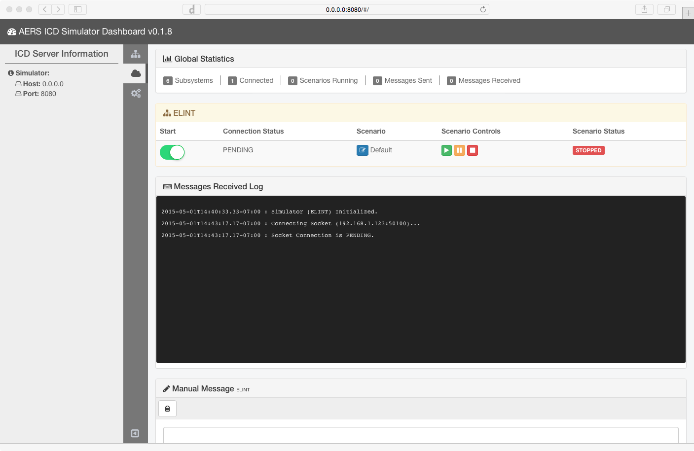

# Screenshots

Image from Tucson newspaper showing the former Department of Homeland Security Secretary Janet Napolitano getting a demo of the Secure Border C3ICop command and control software.

EVE is a comprehensive suite of tools and applications that allow for the management and manipulation of an Electro-Optical Payload.

Generic ICD simulation server that provides a web-based UI control console.

