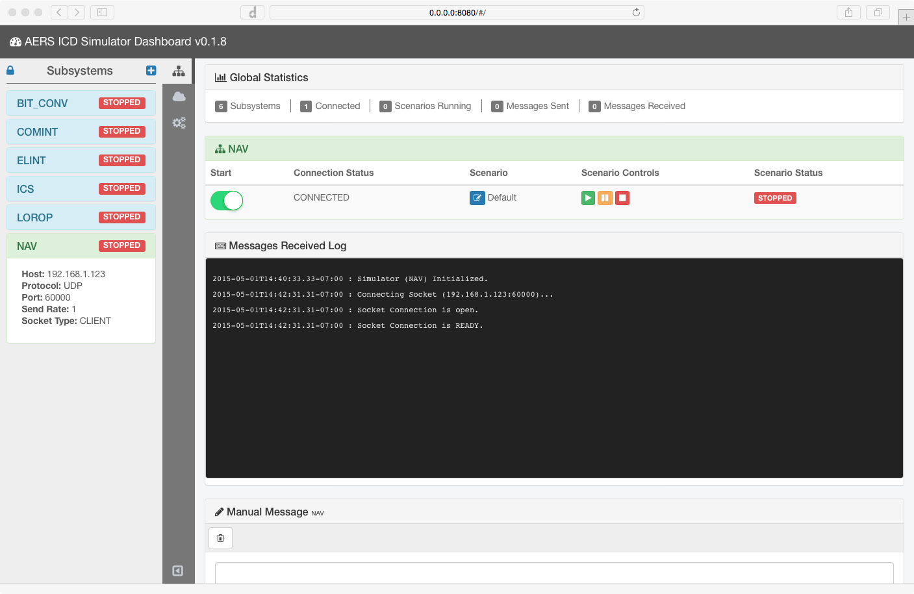

# screenshots

EVE is a comprehensive suite of tools and applications that allow for the management and manipulation of an Electro-Optical Payload.

Generic ICD simulation server that provides a web-based UI control console.

